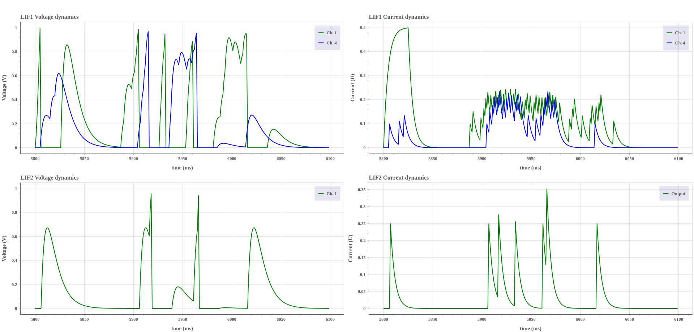

# Network Burst detection

## Conditions for a channel burst
We consider **a channel burst** to be **a neuronal activity where 4 spikes occur within 20ms in the same channel**.

## Different Network burst conditions

### 2 channels burst in a 20ms period
We tried with several different parameters, but the ones that delivered the best results were:
- 20ms refractory period
- 0.25 weight between the LIF layers
- v_th = 1; v_reset = 0; dv = 0.1; du = 0.2

We can see that the LIF2 layer only spikes when ch. 1 and ch. 4 spike in a 20ms period. Additionally, the refractory period of 20ms is enough to prevent undesired spikes.

## Time Interval
I found that the time interval between **5800ms** and **6100ms** has a lot of activity in multiple channels.

