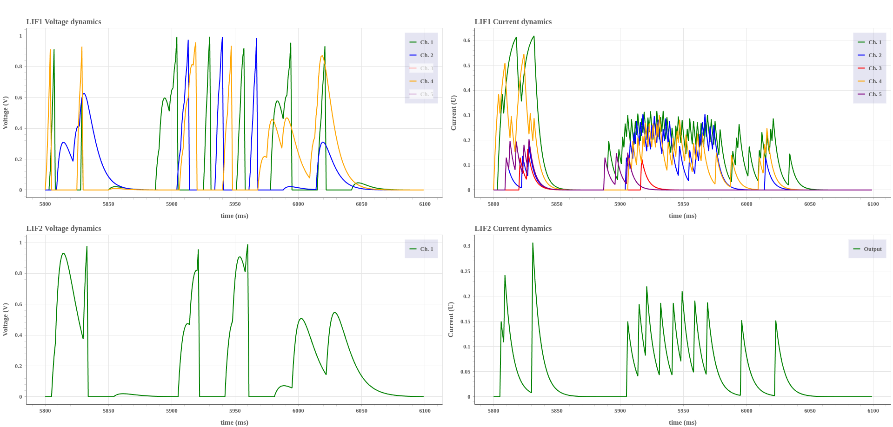

# Network Burst detection

## Conditions for a channel burst
We consider **a channel burst** to be **a neuronal activity where 4 spikes occur within 10ms in the same channel**.

## Different Network burst conditions

### 2 channels burst in a 20ms period (2 channels total)
We tried with several different parameters, but the ones that delivered the best results were:
- 20ms refractory period
- 0.25 weight between the LIF layers
- v_th = 1; v_reset = 0; dv = 0.1; du = 0.2

We can see that the LIF2 layer only spikes when ch. 1 and ch. 4 spike in a 20ms period. Additionally, the refractory period of 20ms is enough to prevent undesired spikes.

### 3 channels burst in a 20ms period (5 channels total)
We tried with several different parameters, but the ones that delivered the best results were:
- 20ms refractory period
- 0.13 weight between SpikeGen and LIF1;0.15 weight between the LIF layers
- v_th = 1; v_reset = 0; dv1 = 0.14; du1 = 0.2; dv2 = 0.1; du2 = 0.15

In this case, we can see that the network burst detection is not perfectly accurate. For example, the first detected network burst is caused by 2 spikes in Ch. 1 and 4, followed by a period of 25ms without any spikes. Then Ch. 1 and 4 spike again, causing the network burst detection. According to our defition, this is not a network burst, but the algorithm detects it as one. This is because the spiking activity is very near to our 20ms window.

The number of False Positives could be reduced by making the prediction more conservative. For example by:
- Increasing the refractory period of the LIF1 layer responsible for the channel burst detection.
- Making the network burst condition more strict. For example, by requiring 3 channels spiking in a 10ms period, instead of 20ms.

## Time Interval
I found that the time interval between **5800ms** and **6100ms** has a lot of activity in multiple channels.

